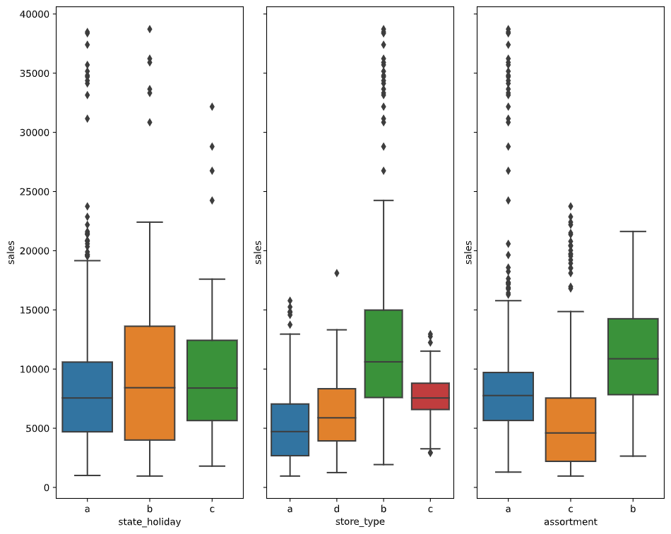

# ROSSMAN SALES: FORECASTING SALES

## Rossman Overview

Rossmann operates over 3,000 drug stores in 7 European countries. Currently, Rossmann store managers are tasked with predicting their daily sales for up to six weeks in advance. Store sales are influenced by many factors, including promotions, competition, school and state holidays, seasonality, and locality. With thousands of individual managers predicting sales based on their unique circumstances, the accuracy of results can be quite varied.

This project aim to predict sales using data from Rossman, using Data Science lifecycle process like:

## The CRISP-DM Cycle for Data Science

For this project, we will use  **CRoss Industry Standard Process for Data Mining (CRISP-DM)** methodology, a process model with six phases that naturally describes the data science life cycle. It’s like a set of guardrails to help you plan, organize, and implement your data science (or machine learning) project.

- Business understanding – *What does the business need?*
- Data understanding – *What data do we have / need? Is it clean?*
- Data preparation – *How do we organize the data for modeling?*
- Modeling – *What modeling techniques should we apply?*
- Evaluation – *Which model best meets the business objectives?*
- Deployment – *How do stakeholders access the results?*

# Table of Content


## 1.0. Business Understanding

> Note: Since we don't have professional ties with Rossman and only have the sales dataset from Kaggle, we don't have any means to acquire the company's data. Therefore, we will validate some hypothetical business situation.

Starting this project with the most important step, understand what to be done. There are three tasks to be done:

- Sales forecast for the next six weeks in their respective regional areas;
- Generate insights about sales;
- Display the forecast results on a smartphone app for CFO.

### 1.1. Solution format

- **Granularity:** daily sales by stores;
- **Kind of problem:** Sales Forecast;
- **Main methods:** Regression, Time Series;
- **Delivering Method:** Real-time six weeks sales forecasting in a smartphone app.

## 2.0. Data Preparation

### 2.1. Data Collection

Data provided by Kaggle: [Rossman Store Sales](https://www.kaggle.com/c/rossmann-store-sales/data)

Files: 
- train.csv - historical data including Sales
- test.csv - historical data excluding Sales
- sample_submission.csv - a sample submission file in the correct format
- store.csv - supplemental information about the stores

### 2.2. Data Description

| VARIABLE                         | DESCRIPTION                                                  | TYPE |
| -------------------------------- | ------------------------------------------------------------ | ---- |
| Id                               | An Id that represents a (Store, Date) duple within the test set |      |
| Store                            | A unique Id for each store                                   |      |
| Sales                            | The turnover for any given day (this is our target variable) |      |
| Customers                        | The number of customers of given day                         |      |
| Open                             | An indicator for whether the store was open: 0 is closed and 1 is open |      |
| StateHoliday                     | indicates a state holiday. Normally all stores, with few exceptions, are closed on state holidays. Note that all schools are closed on public holidays and weekends. a = Public holiday, b = Easter holiday, c = Christmas, 0 = None |      |
| SchoolHoliday                    | Indicates if the (Store, Date) was affected by the closure of public schools |      |
| ScoreType                        | Differentiates between 4 different store models: a, b, c ,d  |      |
| Assortment                       | Describes an assortment level: a = basic, b = extra, c = extended |      |
| CompetitionDistance              | Distance in meters to the nearest competitor store           |      |
| CompetitionOpenSince[Month/Year] | Gives the approximate year and month of the time the nearest competitor was opened |      |
| Promo                            | Indicate whether a store is running a promo on that day      |      |
| Promo2                           | Promo2 is a continuing and consecutive promotion for some stores: 0 = store is not participating, 1 = store is participating |      |
| Promo2Since[Year/Week]           | Describes the year and calendar week when the store started participating in Promo2 |      |
| PromoInterval                    | Describes the consecutive intervals Promo2 is started, naming the months the promotion is started anew. E.g. "Feb, May, Aug, Nov" means each round starts in February, May, August, November of any given year for that store |      |

### 2.3. Knowing Data:

**Dimension**

```
- Number of Rows: 1,017,209
- Number of Columns: 18
- Date Range: from 2013-01-01 to 2015-07-31
```

**Types**

```markdown
store                                    int64
day_of_week                              int64
date                            datetime64[ns]
sales                                    int64
customers                                int64
open                                     int64
promo                                    int64
state_holiday                           object
school_holiday                           int64
store_type                              object
assortment                              object
competition_distance                   float64
competition_open_since_month           float64
competition_open_since_year            float64
promo2                                   int64
promo2_since_week                      float64
promo2_since_year                      float64
promo_interval                          object
month_map                               object
is_promo                                 int64
dtype: object
```

### 2.4. Descriptive Statistical

**Numerical Attributes**

|                              |     count |        mean |          std |    min |      max |    range |      skew | kurtosis   |
| ---------------------------: | --------: | ----------: | -----------: | -----: | -------: | -------: | --------: | ---------- |
|                        store | 1017209.0 |  558.429727 |   321.908651 |  838.0 |   1115.0 |   1114.0 | -0.000955 | -1.200524  |
|                  day_of_week | 1017209.0 |    3.998341 |     1.997391 |    6.0 |      7.0 |      6.0 |  0.001593 | -1.246873  |
|                        sales | 1017209.0 | 5773.818972 |  3849.926175 | 7856.0 |  41551.0 |  41551.0 |  0.641460 | 1.778375   |
|                    customers | 1017209.0 |  633.145946 |   464.411734 |  837.0 |   7388.0 |   7388.0 |  1.598650 | 7.091773   |
|                         open | 1017209.0 |    0.830107 |     0.375539 |    1.0 |      1.0 |      1.0 | -1.758045 | 1.090723   |
|                        promo | 1017209.0 |    0.381515 |     0.485759 |    1.0 |      1.0 |      1.0 |  0.487838 | -1.762018  |
|               school_holiday | 1017209.0 |    0.178647 |     0.383056 |    0.0 |      1.0 |      1.0 |  1.677842 | 0.815154   |
|         competition_distance | 1017209.0 | 5935.442677 | 12547.652996 | 6910.0 | 200000.0 | 199980.0 | 10.242344 | 147.789712 |
| competition_open_since_month | 1017209.0 |    6.786849 |     3.311087 |   10.0 |     12.0 |     11.0 | -0.042076 | -1.232607  |
|  competition_open_since_year | 1017209.0 | 2010.324840 |     5.515593 | 2014.0 |   2015.0 |    115.0 | -7.235657 | 124.071304 |
|                       promo2 | 1017209.0 |    0.500564 |     0.500000 |    1.0 |      1.0 |      1.0 | -0.002255 | -1.999999  |
|            promo2_since_week | 1017209.0 |   23.619033 |    14.310064 |   37.0 |     52.0 |     51.0 |  0.178723 | -1.184046  |
|            promo2_since_year | 1017209.0 | 2012.793297 |     1.662658 | 2014.0 |   2015.0 |      6.0 | -0.784436 | -0.210075  |
|                     is_promo | 1017209.0 |    0.165966 |     0.372050 |    0.0 |      1.0 |      1.0 |  1.795644 | 1.224338   |

**About skew:**

Skewness refer to a distortion (or a measure of the asymmetry) of a probability distribution of a random variable about its mean. If the curve is shifted to the left or to the right, it is said to be skewed. Skewness can be quantified as a representation of the extent to which a given distribution varies from a normal distribution (Bell curve).
In other words, skewness tells you the amount and direction of skew (departure from horizontal symmetry). The skewness value can be positive or negative, or even undefined. If skewness is 0, the data are perfectly symmetrical, although it is quite unlikely for real-world data. As a general rule of thumb:

* If skewness is less than -1 or greater than 1, the distribution is highly skewed.
* If skewness is between -1 and -0.5 or between 0.5 and 1, the distribution is moderately skewed.
* If skewness is between -0.5 and 0.5, the distribution is approximately symmetric.

List of symetrical skew in rossman' data:

```['store', 'day_of_week', 'promo', 'competition_open_since_month', 'promo2', 'promo2_since_week']```

List of moderately skewed:

```['sales', 'promo2_since_year']```

List of highly skewed:

```['customers', 'open', 'school_holiday', 'competition_distance', 'competition_open_since_year', 'is_promo']```

**About Kurtosis**

Kurtosis tells you the height and sharpness of the central peak, relative to that of a standard bell curve. 

High kurtosis indicates that the data has many outliers. Distribution with low kurtosis has fewer and less extreme outliers.

There are three types of kurtosis as follows:

* **Leptokurtic (K > 3):** Distribution has fatter, longer tails, a sharp peak;
* **Mesokurtic (K = 3):** Distribution resembles a normal distribution;
* **Platykurtic (K < 3):** Distribution has shorter, thinner tails.

List of Leptokurtic features:

```['customers', 'competition_distance', 'competition_open_since_year']```

List of Platykurtic:

```['store', 'day_of_week', 'sales', 'open', 'promo', 'school_holiday', 'competition_open_since_month', 'promo2', 'promo2_since_week', 'promo2_since_year', 'is_promo']```

There isn't mesokurtic kurtosis on present dataset.

**Categorical Attributes**



Sales tends to differ in state holidays, store types and assortment.

## 3.0. Hypothesis Creation

To understand the relationship between sales and other features, we raised some hypothesis based on the business problem. The point here is to guide feature engineering and exploratory data analysis.

|List|Hypothesis|
|----|----------|
|01.| Stores with a larger assortment should sell more.|
|02.| Stores with closer competitors should sell less.|
|03.| Stores with longer competitors should sell more|
|04.| Stores with active promotions for longer should sell more.|
|05.| Stores with more promotion days should sell more.|
|06.| Stores with more consecutive promotions should sell more.|
|07.| Stores open during the Christmas holiday should sell more.|
|08.| Stores should be selling more over the years.|
|09.| Stores should sell more in the second half of the year.|
|10.| Stores should sell more after the 10th of each month.|
|11.| Stores should sell less on weekends.|
|12.| Stores should sell less during school holidays.|

### 3.1. Feature Engineering

**Creating feature based on time**
From `date` column and using Pandas function, we created column: `year`, `month`, `day`, `week_of_year` and `year_week`.

**Features based on competition and promo**
* `competition_since`: It stands for how long the competition exists.
* `promo_since`: It stands for how long is there an active promotion.

**Features based on Assortment and Holidays**
Transforming categorical features in more understand information, like `assortment` "a" in 'basic' and "b" in "extended".

### 3.2. Filtering Variables

Since closed stores has no sales, we dropped that rows, just like `sales` with sales equal zero.

For columns we dropped `customers` because we won't have this data available for the next six weeks and `promo_interval` and `month_map` we derive to create new features.

## 4.0. Exploratory Data Analysis (EDA)

The three main goals of EDA is:

1. Gain business experience;
2. Validate business hypothesis (insights);
3. Realize variables relevant to the model.

### 4.1. Univariate Analysis