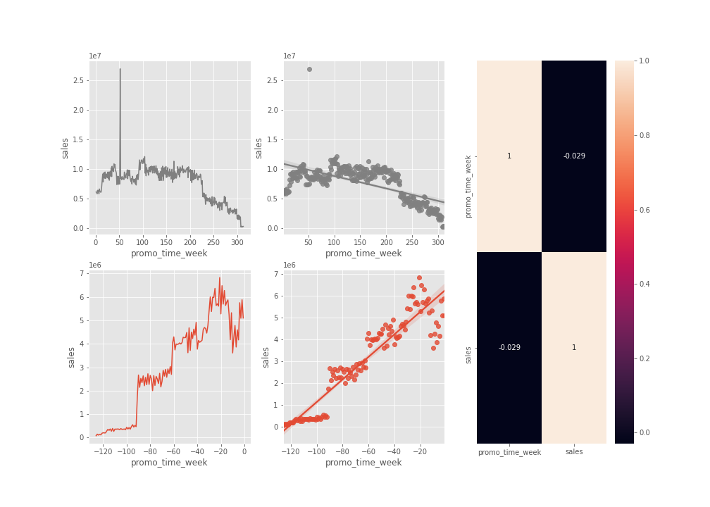

<h1> ROSSMAN SALES: FORECASTING SALES </h1>

<h2> Rossman Overview </h2>

Rossmann operates over 3,000 drug stores in 7 European countries. Currently, Rossmann store managers are tasked with predicting their daily sales for up to six weeks in advance. Store sales are influenced by many factors, including promotions, competition, school and state holidays, seasonality, and locality. With thousands of individual managers predicting sales based on their unique circumstances, the accuracy of results can be quite varied.

This project aim to predict sales using data from Rossman, using Data Science lifecycle process like:

<h3> The CRISP-DM Cycle for Data Science </h3>

For this project, we will use  **CRoss Industry Standard Process for Data Mining (CRISP-DM)** methodology, a process model with six phases that naturally describes the data science life cycle. It’s like a set of guardrails to help you plan, organize, and implement your data science (or machine learning) project.

- Business understanding – *What does the business need?*
- Data understanding – *What data do we have / need? Is it clean?*
- Data preparation – *How do we organize the data for modeling?*
- Modeling – *What modeling techniques should we apply?*
- Evaluation – *Which model best meets the business objectives?*
- Deployment – *How do stakeholders access the results?*

<h1> Table of Content </h1>

- [1.0. Business Understanding](#10-business-understanding)
  - [1.1. Solution format](#11-solution-format)
- [2.0. Data Preparation](#20-data-preparation)
  - [2.1. Data Collection](#21-data-collection)
  - [2.2. Data Description](#22-data-description)
  - [2.3. Knowing Data:](#23-knowing-data)
  - [2.4. Descriptive Statistical](#24-descriptive-statistical)
- [3.0. Hypothesis Creation](#30-hypothesis-creation)
  - [3.1. Feature Engineering](#31-feature-engineering)
  - [3.2. Filtering Variables](#32-filtering-variables)
- [4.0. Exploratory Data Analysis (EDA)](#40-exploratory-data-analysis-eda)
  - [4.1. Univariate Analysis](#41-univariate-analysis)
  - [4.2. Bivariate Analysis:](#42-bivariate-analysis)
    - [H2. Stores with closer competitors should sell less.](#h2-stores-with-closer-competitors-should-sell-less)
    - [H4. Stores with active promotions for longer should sell more.](#h4-stores-with-active-promotions-for-longer-should-sell-more)
    - [H6. Store with more consecutive promotions should sell more.](#h6-store-with-more-consecutive-promotions-should-sell-more)
    - [H10. Stores should sell more after the 10th of each month.](#h10-stores-should-sell-more-after-the-10th-of-each-month)
    - [H12. Stores should sell less during school holidays.](#h12-stores-should-sell-less-during-school-holidays)
    - [List Hypothesis](#list-hypothesis)
  - [4.3. Multivariate Analysis](#43-multivariate-analysis)
    - [Numerical Attributes](#numerical-attributes)
    - [Categorical Attributes](#categorical-attributes)
- [5.0. Data Preparation](#50-data-preparation)
  - [5.1. Encoding Transformation](#51-encoding-transformation)
  - [5.2. Rescaling](#52-rescaling)
  - [5.3. Cyclic Transformation / Nature Transformation](#53-cyclic-transformation--nature-transformation)
- [6.0. Feature Selection](#60-feature-selection)
- [7.0. Machine Learning Modelling](#70-machine-learning-modelling)
- [8.0. Hyperparameter Fine Tuning](#80-hyperparameter-fine-tuning)
  - [8.1. Single Performance - Final](#81-single-performance---final)
  - [8.2. Real Performance - Final](#82-real-performance---final)
- [9.0. Evaluation](#90-evaluation)
  - [9.1. Business Performance](#91-business-performance)
  - [9.2. Machine Learning Performance](#92-machine-learning-performance)
- [10.0. Deployment](#100-deployment)
  - [10.1. Rossmann Bot in Telegram](#101-rossmann-bot-in-telegram)
  - [10.2. Telegram Bot Architecture](#102-telegram-bot-architecture)
  - [10.3. Predicting with Telegram Bot](#103-predicting-with-telegram-bot)
- [11.0. Conclusion](#110-conclusion)
  - [11.1. Next Steps](#111-next-steps)

---

## 1.0. Business Understanding

> Note: Since we don't have professional ties with Rossman and only have the sales dataset from Kaggle, we don't have any means to acquire the company's data. Therefore, we will validate some hypothetical business situation.

Starting this project with the most important step, understand what to be done. There are three tasks to be done:

- Sales forecast for the next six weeks in their respective regional areas;
- Generate insights about sales;
- Display the forecast results on a smartphone app for CFO.

### 1.1. Solution format

- **Granularity:** daily sales by stores;
- **Kind of problem:** Sales Forecast;
- **Main methods:** Regression, Time Series;
- **Delivering Method:** Real-time six weeks sales forecasting in a smartphone app.

---

## 2.0. Data Preparation

### 2.1. Data Collection

Data provided by Kaggle: [Rossman Store Sales](https://www.kaggle.com/c/rossmann-store-sales/data)

Files: 
- train.csv - historical data including Sales
- test.csv - historical data excluding Sales
- sample_submission.csv - a sample submission file in the correct format
- store.csv - supplemental information about the stores

### 2.2. Data Description

| VARIABLE                         | DESCRIPTION                                                  | TYPE |
| -------------------------------- | ------------------------------------------------------------ | ---- |
| Id                               | An Id that represents a (Store, Date) duple within the test set |      |
| Store                            | A unique Id for each store                                   |      |
| Sales                            | The turnover for any given day (this is our target variable) |      |
| Customers                        | The number of customers of given day                         |      |
| Open                             | An indicator for whether the store was open: 0 is closed and 1 is open |      |
| StateHoliday                     | indicates a state holiday. Normally all stores, with few exceptions, are closed on state holidays. Note that all schools are closed on public holidays and weekends. a = Public holiday, b = Easter holiday, c = Christmas, 0 = None |      |
| SchoolHoliday                    | Indicates if the (Store, Date) was affected by the closure of public schools |      |
| ScoreType                        | Differentiates between 4 different store models: a, b, c ,d  |      |
| Assortment                       | Describes an assortment level: a = basic, b = extra, c = extended |      |
| CompetitionDistance              | Distance in meters to the nearest competitor store           |      |
| CompetitionOpenSince[Month/Year] | Gives the approximate year and month of the time the nearest competitor was opened |      |
| Promo                            | Indicate whether a store is running a promo on that day      |      |
| Promo2                           | Promo2 is a continuing and consecutive promotion for some stores: 0 = store is not participating, 1 = store is participating |      |
| Promo2Since[Year/Week]           | Describes the year and calendar week when the store started participating in Promo2 |      |
| PromoInterval                    | Describes the consecutive intervals Promo2 is started, naming the months the promotion is started anew. E.g. "Feb, May, Aug, Nov" means each round starts in February, May, August, November of any given year for that store |      |

### 2.3. Knowing Data:

**Dimension**

```
- Number of Rows: 1,017,209
- Number of Columns: 18
- Date Range: from 2013-01-01 to 2015-07-31
```

**Types**

```markdown
store                                    int64
day_of_week                              int64
date                            datetime64[ns]
sales                                    int64
customers                                int64
open                                     int64
promo                                    int64
state_holiday                           object
school_holiday                           int64
store_type                              object
assortment                              object
competition_distance                   float64
competition_open_since_month           float64
competition_open_since_year            float64
promo2                                   int64
promo2_since_week                      float64
promo2_since_year                      float64
promo_interval                          object
month_map                               object
is_promo                                 int64
dtype: object
```

### 2.4. Descriptive Statistical

**Numerical Attributes**

|                              |     count |        mean |          std |    min |      max |    range |      skew | kurtosis   |
| ---------------------------: | --------: | ----------: | -----------: | -----: | -------: | -------: | --------: | ---------- |
|                        store | 1017209.0 |  558.429727 |   321.908651 |  838.0 |   1115.0 |   1114.0 | -0.000955 | -1.200524  |
|                  day_of_week | 1017209.0 |    3.998341 |     1.997391 |    6.0 |      7.0 |      6.0 |  0.001593 | -1.246873  |
|                        sales | 1017209.0 | 5773.818972 |  3849.926175 | 7856.0 |  41551.0 |  41551.0 |  0.641460 | 1.778375   |
|                    customers | 1017209.0 |  633.145946 |   464.411734 |  837.0 |   7388.0 |   7388.0 |  1.598650 | 7.091773   |
|                         open | 1017209.0 |    0.830107 |     0.375539 |    1.0 |      1.0 |      1.0 | -1.758045 | 1.090723   |
|                        promo | 1017209.0 |    0.381515 |     0.485759 |    1.0 |      1.0 |      1.0 |  0.487838 | -1.762018  |
|               school_holiday | 1017209.0 |    0.178647 |     0.383056 |    0.0 |      1.0 |      1.0 |  1.677842 | 0.815154   |
|         competition_distance | 1017209.0 | 5935.442677 | 12547.652996 | 6910.0 | 200000.0 | 199980.0 | 10.242344 | 147.789712 |
| competition_open_since_month | 1017209.0 |    6.786849 |     3.311087 |   10.0 |     12.0 |     11.0 | -0.042076 | -1.232607  |
|  competition_open_since_year | 1017209.0 | 2010.324840 |     5.515593 | 2014.0 |   2015.0 |    115.0 | -7.235657 | 124.071304 |
|                       promo2 | 1017209.0 |    0.500564 |     0.500000 |    1.0 |      1.0 |      1.0 | -0.002255 | -1.999999  |
|            promo2_since_week | 1017209.0 |   23.619033 |    14.310064 |   37.0 |     52.0 |     51.0 |  0.178723 | -1.184046  |
|            promo2_since_year | 1017209.0 | 2012.793297 |     1.662658 | 2014.0 |   2015.0 |      6.0 | -0.784436 | -0.210075  |
|                     is_promo | 1017209.0 |    0.165966 |     0.372050 |    0.0 |      1.0 |      1.0 |  1.795644 | 1.224338   |

**About skew:**

Skewness refer to a distortion (or a measure of the asymmetry) of a probability distribution of a random variable about its mean. If the curve is shifted to the left or to the right, it is said to be skewed. Skewness can be quantified as a representation of the extent to which a given distribution varies from a normal distribution (Bell curve).
In other words, skewness tells you the amount and direction of skew (departure from horizontal symmetry). The skewness value can be positive or negative, or even undefined. If skewness is 0, the data are perfectly symmetrical, although it is quite unlikely for real-world data. As a general rule of thumb:

* If skewness is less than -1 or greater than 1, the distribution is highly skewed.
* If skewness is between -1 and -0.5 or between 0.5 and 1, the distribution is moderately skewed.
* If skewness is between -0.5 and 0.5, the distribution is approximately symmetric.

List of symmetrical skew in Rossman' data:

```['store', 'day_of_week', 'promo', 'competition_open_since_month', 'promo2', 'promo2_since_week']```

List of moderately skewed:

```['sales', 'promo2_since_year']```

List of highly skewed:

```['customers', 'open', 'school_holiday', 'competition_distance', 'competition_open_since_year', 'is_promo']```

**About Kurtosis**

Kurtosis tells you the height and sharpness of the central peak, relative to that of a standard bell curve. 

High kurtosis indicates that the data has many outliers. Distribution with low kurtosis has fewer and less extreme outliers.

There are three types of kurtosis as follows:

* **Leptokurtic (K > 3):** Distribution has fatter, longer tails, a sharp peak;
* **Mesokurtic (K = 3):** Distribution resembles a normal distribution;
* **Platykurtic (K < 3):** Distribution has shorter, thinner tails.

List of Leptokurtic features:

```['customers', 'competition_distance', 'competition_open_since_year']```

List of Platykurtic:

```['store', 'day_of_week', 'sales', 'open', 'promo', 'school_holiday', 'competition_open_since_month', 'promo2', 'promo2_since_week', 'promo2_since_year', 'is_promo']```

There isn't mesokurtic kurtosis on present dataset.

**Categorical Attributes**


Sales tends to differ in state holidays, store types and assortment.

---

## 3.0. Hypothesis Creation

To understand the relationship between sales and other features, we raised some hypothesis based on the business problem. The point here is to guide feature engineering and exploratory data analysis.

|List|Hypothesis|
|----|----------|
|01.| Stores with a larger assortment should sell more.|
|02.| Stores with closer competitors should sell less.|
|03.| Stores with longer competitors should sell more|
|04.| Stores with active promotions for longer should sell more.|
|05.| Stores with more promotion days should sell more.|
|06.| Stores with more consecutive promotions should sell more.|
|07.| Stores open during the Christmas holiday should sell more.|
|08.| Stores should be selling more over the years.|
|09.| Stores should sell more in the second half of the year.|
|10.| Stores should sell more after the 10th of each month.|
|11.| Stores should sell less on weekends.|
|12.| Stores should sell less during school holidays.|

### 3.1. Feature Engineering

**Creating feature based on time**
From `date` column and using Pandas function, we created column: `year`, `month`, `day`, `week_of_year` and `year_week`.

**Features based on competition and promo**
* `competition_since`: It stands for how long the competition exists.
* `promo_since`: It stands for how long is there an active promotion.

**Features based on Assortment and Holidays**
Transforming categorical features in more understand information, like `assortment` "a" in 'basic' and "b" in "extended".

### 3.2. Filtering Variables

Since closed stores has no sales, we dropped that rows, just like `sales` with sales equal zero.

For columns we dropped `customers` because we won't have this data available for the next six weeks and `promo_interval` and `month_map` we derive to create new features.

---

## 4.0. Exploratory Data Analysis (EDA)

The three main goals of EDA is:

1. Gain business experience;
2. Validate business hypothesis (insights);
3. Realize variables relevant to the model.

### 4.1. Univariate Analysis

Probability density function is a function whose value at any given sample (or point) in the sample space can be interpreted as providing a relative likelihood that the value of the random variable would equal the sample.

* **Target variable (sales):** the distribution look like positive skew. Probably we will need to rescale our data before training section.


* **Numerical variables (histograms):**


Some observations:
* `customers` - higher sales when the customer range is between 0 and 2000.
* `competition distance` - grand part of competitors are very close.
* `competition_open_since_month` - most of competitors are concentrated at beginning and end of the year, November has the highest concentration. 
* `competition_open_since_year` - between 2010 and 2015 had the biggest increase in competitors.
* `is_promo` - there is more sales when don't have promotion.

* **Categorical variables (barplots):**


### 4.2. Bivariate Analysis:

Analyzing how each independent features behaves against sales. In this section we will validate or reject some hypothesis, aiming for some insights.

I will not include all hypothesis in this document, they can be seen on the [notebook](notebook/c01_01_Rossman.ipynb).

#### H2. Stores with closer competitors should sell less.
*FALSE: Stores nears competitors sell more than stores with competitors located far away.*


#### H4. Stores with active promotions for longer should sell more.
*False: Stores with active promotion for longer sell less, after a period of time.*



#### H6. Store with more consecutive promotions should sell more.
*False: Stores with more consecutive promotions sell less.*

|promo|promo2|sales|
|-----|------|-----|
|1|0|1628930532|
|0|0|1482612096|
|1|1|1472275754|
|0|1|1289362241|


#### H10. Stores should sell more after the 10th of each month.
*True: Store sell more after the 10th of each month*


#### H12. Stores should sell less during school holidays.
*True: Stores sell less during school holidays.*


#### List Hypothesis

| Nº   | Hypothesis                                                 | Conclusion    |
| ---- | ---------------------------------------------------------- | ------------- |
| H1   | Stores with a larger assortment should sell more.          | False         |
| H2   | Stores with closer competitors should sell less.           | False         |
| H3   | Stores with longer competitors should sell more.           | False         |
| H4   | Stores with active promotions for longer should sell more. | False         |
| H5   | Stores with more promotion days should sell more.          | No conclusion |
| H6   | Stores with more consecutive promotions should sell more.  | False         |
| H7   | Stores open during the Christmas holiday should sell more. | False         |
| H8   | Stores should be selling more over the years.              | False         |
| H9   | Stores should sell more in the second half of the year.    | False         |
| H10  | Stores should sell more after the 10th of each month.      | True          |
| H11  | Stores should sell less on weekends.                       | True          |
| H12  | Stores should sell less during school holidays.            | True          |

> Note: For H5 we decided to answer in second cycle of CRISP-DM

### 4.3. Multivariate Analysis

#### Numerical Attributes


#### Categorical Attributes


Later we will make a feature selection using importance selection algorithms, one of the data scientist's jobs is to be skeptical and to believe in some of their decisions. Some of the insights generated will be important to materialize feature selection.

---

## 5.0. Data Preparation

Some variables presents distinct range, others are classify as categorical, numerical. Most Machine Learning requires data to be formatted in a very specific way, so dataset require some amount of preparation. Good data preparation produces clean and well-curated data which leads to more practical.

### 5.1. Encoding Transformation

* `state holiday` - use one hot encoding from pandas package `get_dummies`, convert categorical variable into dummy/indicator variables.
* `store_type` -  label encoding was used from Sklearn package `LabelEncoder`. Encode target labels with value between 0 and 1.
* `assortment` - ordinal encoding using `map` function from pandas package.
* `sales` - the target variable received a logarithmic transformation.

### 5.2. Rescaling

* MinMaxScaler: This technique subtracts each variable value to the variable mean, and then divides by the variable's range: `year` and `promo_time_week`
* RobustScaler: Is the alternative when your features has a big quantity of outliers: `competition_distance` and `competition_time_month`.

### 5.3. Cyclic Transformation / Nature Transformation

Some time-related data has a cyclical nature, the idea here is thinking of the trigonometry circle in terms of time, when the time start running the circle, at some point you will go back to the same place you have started.
Using sin and cosine transformation on the following variables: 'day_of_week`, `month`, `day` and `week_of_year`.

---

## 6.0. Feature Selection
Feature selection is the process of reducing the number of input variables and computational cost. We are implementing the BorutaPy package, the implementation tries to mimic the scikit-learn interface, so use `fit`, `transform` or `fit_transform` to run the feature selection.

Boruta is an all relevant feature selection method, while most other are minimal optimal; this means it tries to find all features carrying information usable for prediction, rather than finding a possibly compact subset of features on which some classifier has a minimal error.

More information about Boruta: [here](https://notabug.org/mbq/Boruta/wiki/FAQ).

 ```
 cols_selected_boruta = [
    'store',
    'promo',
    'store_type',
    'assortment',
    'competition_distance',
    'competition_open_since_month',
    'competition_open_since_year',
    'promo2',
    'promo2_since_week',
    'promo2_since_year',
    'competition_time_month',
    'promo_time_week',
    'day_of_week_sin',
    'day_of_week_cos',
    'month_sin',
    'month_cos',
    'day_sin',
    'day_cos',
    'week_of_year_sin',
    'week_of_year_cos'] 
 ```

---

## 7.0. Machine Learning Modelling

This step aim to choose the best Machine Learning model. We performed 5 models:

<ol>
<li> Average Model (baseline);</li>
<li> Linear Regression Model; </li>
<li> Linear regression Regularized Model - Lasso; </li>
<li> Decision Tree Regressor; </li>
<li> XGBoost Regressor. </li>
</ol>

The **Average Model** is a simple model to serve as a baseline to compare if the others are better than the mean. **Regression** is a technique that fits the best line that minimizes the error in order to predict a dependent continuous variable. **Ensemble** model like Decision Tree Regressor is a flowchart-like structure in which each internal node represents a "test" on an attribute, each branch represents the outcome of the test. **XGBoost** it is based on decision tree, but uses gradient boosting algorithms.

After fit the models, here our results:

|      |                model name |         MAE |     MAPE |        RMSE |
| ---: | ------------------------: | ----------: | -------: | ----------: |
|    0 |             Average Model | 1354.800353 | 0.206400 | 1835.135542 |
|    1 |         Linear Regression | 1867.089774 | 0.292694 | 2671.049215 |
|    2 | Linear Regression - Lasso | 1891.704881 | 0.289106 | 2744.451737 |
|    3 |   Decision Tree Regressor |  970.590975 | 0.145819 | 1479.479613 |
|    4 |         XGBoost Regressor |  718.803066 | 0.105418 | 1041.185015 |

To validate our models, the re-sample procedure named Cross-validation across time period. The procedure has a single parameter called "k" that refers to the number of groups that a given data sample is to be split into.

The results is shown above:


|  |Model|MAE CV|MAE_STD CV|MAPE CV|MAPE_STD CV|RMSE CV|RMSE_STD CV|
|--|-----|--------|-----------|--------|-----------|-------|-----------|
|0|	Linear Regression CV|2081.73|295.63|0.30|0.02|2952.52|468.37|
|1|	Lasso CV|2116.38|341.50|0.29|0.01|3057.75|504.26|
|2|	Decision Tree Regressor CV|	1129.32|286.39|0.16|0.03|1719.94|471.82|
|3|	XGBoost Regressor CV|933.60|168.39|0.13|0.02|1340.71|230.12|

XGBoost is the best model.

---

## 8.0. Hyperparameter Fine Tuning

In this task our goal is to find the best parameters that maximize the learning in our model. The best parameters are found by testing a set of parameters iteratively. In this project we will use Random Search, this method randomly chooses parameters from a given list of candidates. It is the fastest method available:

**Best Params**:
``` 
{'n_estimators': 1700, 'eta': 0.03, 'max_depth': 9, 'subsample': 0.7, 'min_child_weight': 15}
```

### 8.1. Single Performance - Final

|      |                model name |         MAE |     MAPE |        RMSE |
| ---: | ------------------------: | ----------: | -------: | ----------: |
|    0 |             Average Model | 1354.800353 | 0.206400 | 1835.135542 |
|    1 |         Linear Regression | 1867.089774 | 0.292694 | 2671.049215 |
|    2 | Linear Regression - Lasso | 1891.704881 | 0.289106 | 2744.451737 |
|    3 |   Decision Tree Regressor |  970.590975 | 0.145819 | 1479.479613 |
|    4 |         XGBoost Regressor |  718.803066 | 0.105418 | 1041.185015 |
|    5 |       XGBoost Regressor + |  637.498339 | 0.092580 |  933.606168 |


### 8.2. Real Performance - Final

|  |Model|MAE CV|MAE_STD CV|MAPE CV|MAPE_STD CV|RMSE CV|RMSE_STD CV|
|--|-----|--------|-----------|--------|-----------|-------|-----------|
|0|	Linear Regression CV|2081.73|295.63|0.30|0.02|2952.52|468.37|
|1|	Lasso CV|2116.38|341.50|0.29|0.01|3057.75|504.26|
|2|	Decision Tree Regressor CV|	1129.32|286.39|0.16|0.03|1719.94|471.82|
|3|	XGBoost Regressor CV|933.60|168.39|0.13|0.02|1340.71|230.12|
|4|	XGBoost Regressor CV +|821.21|121.75|0.12|0.01|1183.23|186.45|

MAPE improved by 1%.

---

## 9.0. Evaluation

### 9.1. Business Performance
For each store is measured by the average of all predicted sales for the next six weeks. We get the Best Scenario sum up the prediction with the Mean Absolute Error (MAE) and Worst Scenarios subtracting prediction with the MAE. A sample of our model performance below:

| store | predictions | worst_scenario | best_scenario |           MAE |        MAPE |          |
| ----: | ----------: | -------------: | ------------: | ------------: | ----------: | -------- |
|   291 |         292 |  104950.578125 | 101594.947767 | 108306.208483 | 3355.630358 | 0.564530 |
|   908 |         909 |  227714.828125 | 220002.991381 | 235426.664869 | 7711.836744 | 0.512362 |
|   285 |         286 |  186474.453125 | 185122.359896 | 187826.546354 | 1352.093229 | 0.464166 |
|   102 |         103 |  238260.875000 | 236520.554160 | 240001.195840 | 1740.320840 | 0.374698 |
|   169 |         170 |  204650.843750 | 203226.550695 | 206075.136805 | 1424.293055 | 0.356822 |

### 9.2. Machine Learning Performance


**The first square** it is possible to seem a line plot with predictions (in red) were fairly on par with true values (blue).

**The second square** show the error rate between prediction and observed values across six weeks. Ideally, errors should be close to the dashed line, since it represents an error rate of 1, when predicted values are equal to observed one. The error rate range are short, so our model looks good.

**The third square** is a premises for a good machine learning model: to have a normal-shaped distribution of residuals with mean zero. We can observe that the errors are centered around zero, it is a bell-shaped curve.

**The fourth square** is a scatter plot that help us analyze the residuals, expected a "tube" shape, since it is represents low error variance across all values that sales prediction can assume.

---

## 10.0. Deployment

In this section, we will deploy our model, at this stage the results have to be delivered or presented for stakeholders.

### 10.1. Rossmann Bot in Telegram

Using the [BotFather](https://telegram.me/BotFather) to create our bot. Check the documentation to more details: [Documentation](https://core.telegram.org/bots#3-how-do-i-create-a-bot)

### 10.2. Telegram Bot Architecture

The user sends a message to the bot with store id and sends it to the Rossmann API ([rossmann-bot.py](rossmann-telegram-api/rossmann-bot.py)) receive the request and parses the message to extract the `store_id`, then it calls a method from the [Handler API](webapp/handler.py) sending the data. The Handler API makes all the process on data to shape the raw data and generate predictions, then it returns the prediction to the Rossmann API. The Rossmann API returns the sales prediction to the user on Telegram.

### 10.3. Predicting with Telegram Bot


---
## 11.0. Conclusion

In this project it was possible to carry out all the steps of a complete Data Science project, using a CRISP-DM project management methodology cycle we performed a satisfactory model by using XGBoost regressor algorithm. We deepen the knowledge Rossmann's sales using exploratory data analysis and ending with a telegram bot that shows sales predictions.
It takes much more than tools to be a Data Scientist, understanding the problem and search for solution are the main aspects to guide your projects and develop a suitable solution.
This project was mentored by Meigarom Lopes who guided [Data Science em Produção](https://sejaumdatascientist.com/como-ser-um-data-scientist/) course. 

### 11.1. Next Steps

* Experimenting other Machine Learning algorithms.
* Creating new features to see how much the performance is impacted.
* Improve telegram bot with new 